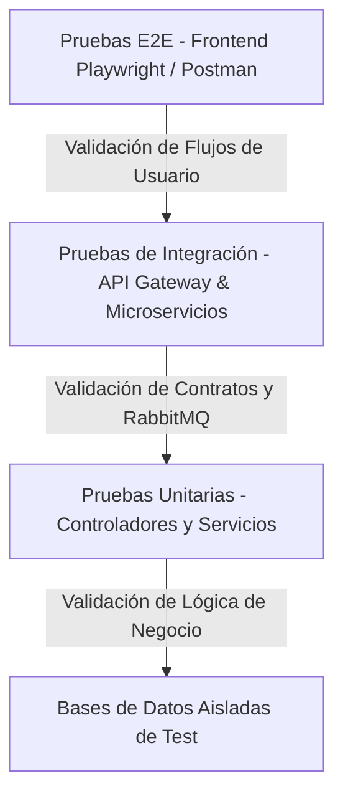

# Documento de Pruebas y Estrategia de Validación - Sistema de Parqueadero Distribuido

Este documento describe la estrategia integral de pruebas diseñada e implementada para validar el correcto funcionamiento, la seguridad, la concurrencia y la tolerancia a fallos del **Sistema de Gestión de Parqueaderos Distribuido (PARKING_DISTRIBUIDAS_V2)**.

---

## 1. Arquitectura de Pruebas

El sistema utiliza una estrategia de pruebas multinivel (Pirámide de Pruebas) adaptada a una arquitectura de microservicios distribuidos:



### Niveles de Evaluación:
1. **Pruebas Unitarias (Microservicios):** Validación aislada de lógica de negocio, cálculo de tarifas, mapeo de DTOs y validaciones de entidades usando frameworks nativos (`Jest` / `Supertest` en NestJS, `pytest` en Python, `JUnit5` / `Mockito` en Spring Boot).
2. **Pruebas de Integración y Seguridad (API Gateway & Auth):** Verificación de la propagación de identidades, validación de tokens JWT en Kong Gateway, políticas de autorización (RBAC) y comunicación asíncrona mediante RabbitMQ.
3. **Pruebas E2E del Sistema Completo (Python & Playwright):** Ejecución de scripts automatizados contra el clúster dockerizado y validación de la interfaz de usuario en navegadores reales.
4. **Validación de Contratos de API (Postman Collections):** Colecciones extensivas para pruebas de regresión e inspección de endpoints HTTP.

---

## 2. Suite de Pruebas Automatizadas de Integración (Python)

En la raíz del proyecto se incluye una suite de scripts automatizados en Python con `pytest` y `requests`/`httpx` diseñados para ejecutarse contra el entorno desplegado:

| Archivo de Prueba | Móduo / Alcance | Descripción de la Validación |
| :--- | :--- | :--- |
| `test_auth_authz.py` | **Autenticación y RBAC** | Verifica inicio de sesión, expiración de tokens, denegación de acceso (403 Forbidden) para roles no autorizados y acceso permitido para `ADMIN` / `ROOT`. |
| `test_zonas.py` | **Gestión de Zonas y Espacios** | Evalúa la creación de zonas, actualización de capacidad, registro y cambio de estado de espacios (Ocupado / Libre / Inhabilitado). |
| `test_audit.py` | **Eventos de Auditoría** | Verifica que las acciones críticas en el sistema emitan eventos asíncronos a RabbitMQ y sean registrados por `ms-auditoria`. |
| `test_user_audit.py` | **Reglas de Usuarios** | Valida restricciones de creación, modificación y bloqueo de cuentas de usuario, y su respectiva traza de auditoría. |
| `test_login_audit.py` | **Auditoría de Acceso** | Revisa la captura de eventos de intento exitoso y fallido de login por motivos de seguridad. |
| `test.py` | **Prueba de Humo (Smoke Test)** | Verificación rápida de disponibilidad (Health Check) de Kong Gateway y servicios core. |

### Instrucciones de Ejecución:

```bash
# 1. Asegurar que el entorno de pruebas o desarrollo esté activo
docker-compose up -d

# 2. Instalar dependencias de pruebas en Python
pip install pytest requests httpx

# 3. Ejecutar la suite completa de pruebas de regresión
pytest test_*.py -v --tb=short

# 4. Ejecutar pruebas con reporte de logs
pytest test_auth_authz.py test_zonas.py -v | tee test_log.txt
```

---

## 3. Pruebas End-to-End (E2E) del Frontend - Playwright

El microservicio frontend (`parking-frontend`) incluye un entorno automatizado de pruebas E2E utilizando **Playwright**, verificando la experiencia de usuario real en navegadores Chromium, Firefox y WebKit.

### Flujos Validados en E2E:
- **Autenticación UI:** Inicio de sesión con credenciales válidas e inválidas, manejo de redirección y almacenamiento seguro del token.
- **Gestión Visual de Zonas:** Mapeo en tiempo real de espacios libres y ocupados (integración con Server-Sent Events / SSE).
- **Emisión y Salida de Tickets:** Selección de vehículo, creación de ticket de parqueo y cálculo de cobro en interfaz.

### Ejecución de Pruebas E2E:

```bash
cd parking-frontend

# 1. Instalar dependencias de desarrollo y navegadores
npm install
npx playwright install --with-deps

# 2. Ejecutar suite E2E en modo headless (consola)
npm run e2e

# 3. Ejecutar suite E2E en modo UI (interactivo)
npm run e2e:ui
```

---

## 4. Colecciones de Postman para Validación de Contratos

Para la ejecución manual, regresión e inspección de las APIs RESTful a través de Kong Gateway (`http://localhost:8000`), el repositorio adjunta colecciones completas y parametrizadas:

1. **`parking_postman_collection_full.json`**: Colección maestra con más de 80 peticiones organizadas por módulo (Auth, Usuarios, Vehículos, Zonas, Asignaciones, Tickets, Auditoría), incluyendo scripts de pre-request para auto-inyección de tokens JWT.
2. **`Audit_Create_Operations.postman_collection.json`**: Colección especializada en verificar los tiempos de latencia y registro en el módulo de auditoría tras operaciones de alta concurrencia.

### Cómo Importar en Postman:
1. Abrir Postman -> `Import` -> Seleccionar los archivos `.json` en la raíz del repositorio.
2. Configurar la variable de colección `baseUrl` como `http://localhost:8000`.
3. Ejecutar la carpeta `Auth -> Login Root` para poblar automáticamente la variable de entorno `{{token}}`.

---

## 5. Entorno de Pruebas Aislado con Docker Compose

Para evitar contaminar las bases de datos de desarrollo, se proporciona el archivo de orquestación `docker-compose-test.yml`, el cual levanta contenedores de base de datos efímeros e inyecta configuraciones de test:

```bash
# Levantar servicios en modo test aislado
docker-compose -f docker-compose-test.yml up --build --abort-on-container-exit
```

---

## 6. Enlaces de Referencia del Sistema

* [Especificación Detallada de Casos de Prueba](./CASOS_DE_PRUEBA.md)
* [Arquitectura y Documentación General](./README.md)
* [Guía de Despliegue en Kubernetes](./GUIA_KUBERNETES.md)
